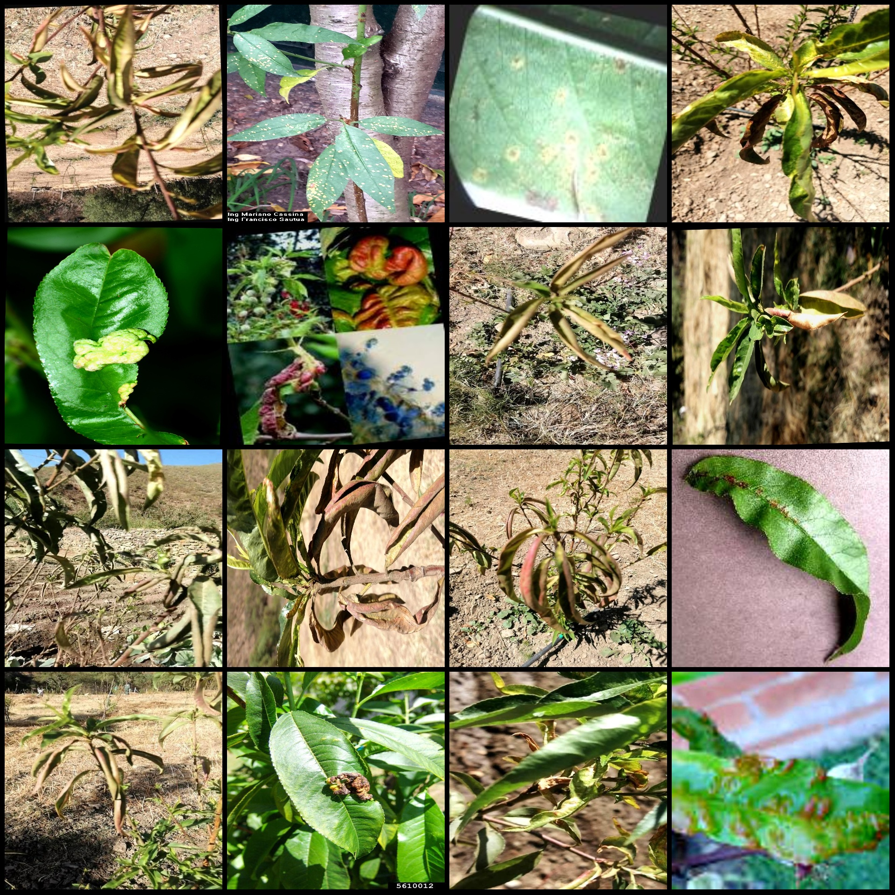
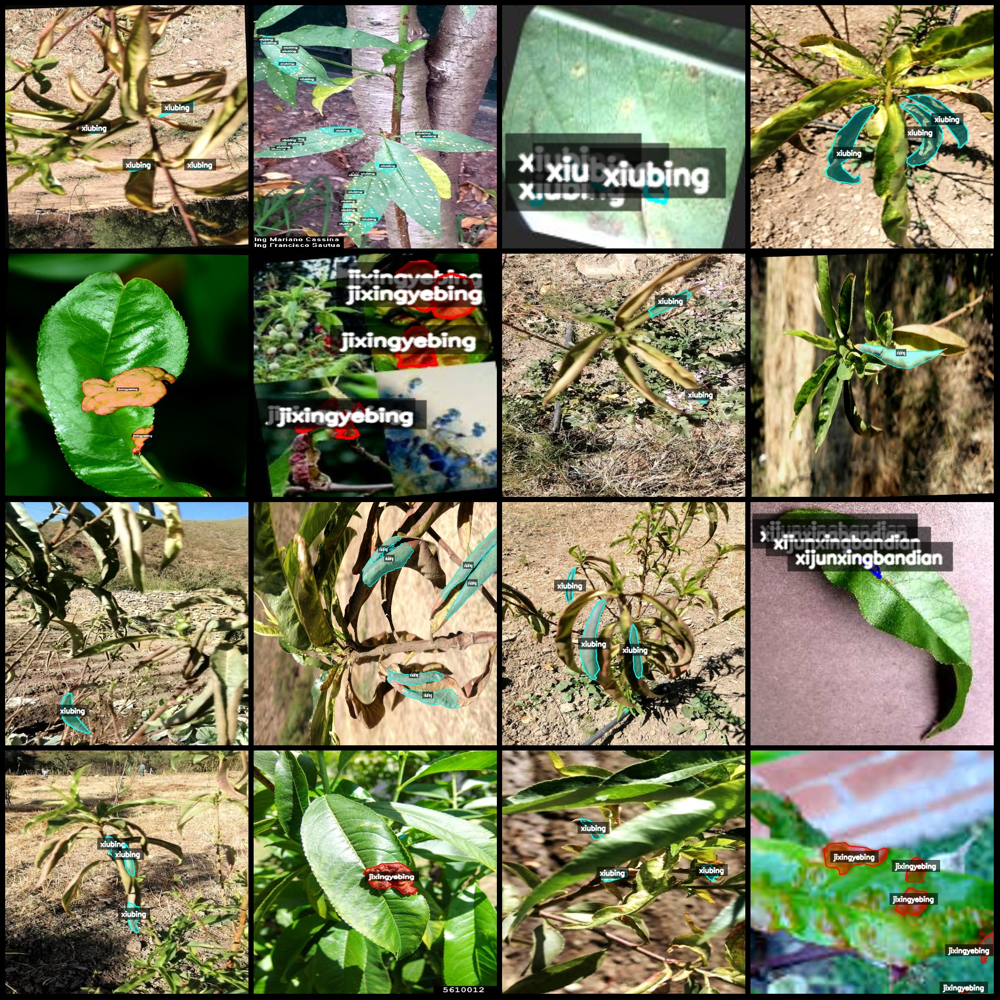
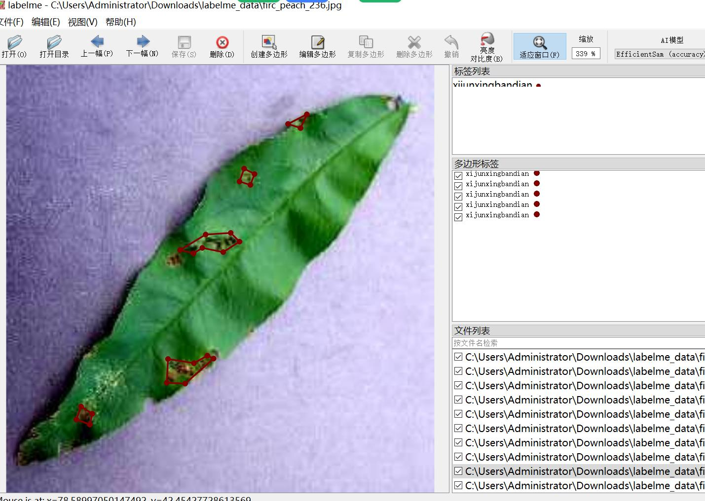
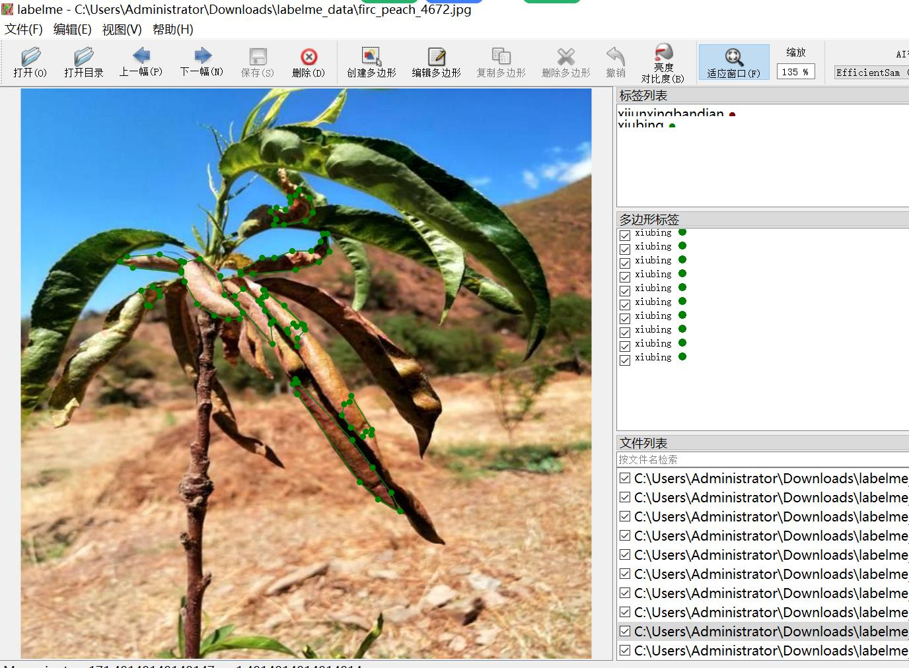

# Smart Orchard Peach Leaves Disease Identification and Segmentation Dataset - LabelMe Format with 2918 Images in 3 Categories

The dataset format: LabelMe (excluding mask files, only containing JPG images and corresponding JSON files).
Number of images (JPG file count): 2918
Number of annotations (JSON file count): 2918
Number of categories: 3
Annotation categories: ["jixingyebing", "xijunxingbandian", "xiubing"]
Corresponding Chinese category names: ["Bacterial spot", "Rust disease", "Dwarf leaf disease"]
Number of boxes for each category:
jixingyebing count = 1475
xijunxingbandian count = 3776
xiubing count = 7960
Total number of boxes: 13211

Annotation tool used: labelme=5.5.0
Image resolution: Multiple resolution images, such as 640x640, 256x256, etc.
Annotation rules: Polygons are drawn around the categories.

Important Notice: The dataset can be edited using LabelMe, but JSON datasets need to be converted into either mask or YOLOF/COCO format for semantic segmentation or instance segmentation.
Special Declaration: This dataset does not guarantee the accuracy of the trained model or weight files.

Image previews:

Annotation example:

Original images (randomly selected 16 images):

Annotation drawing results:

## Images

Here is a pay link on Stripe ( https://buy.stripe.com/3cs8yP7sY87d0vu9AB ). Please contact me lonlonago@foxmail.com after funding $89, and I will send you a complete data files , thank you!

